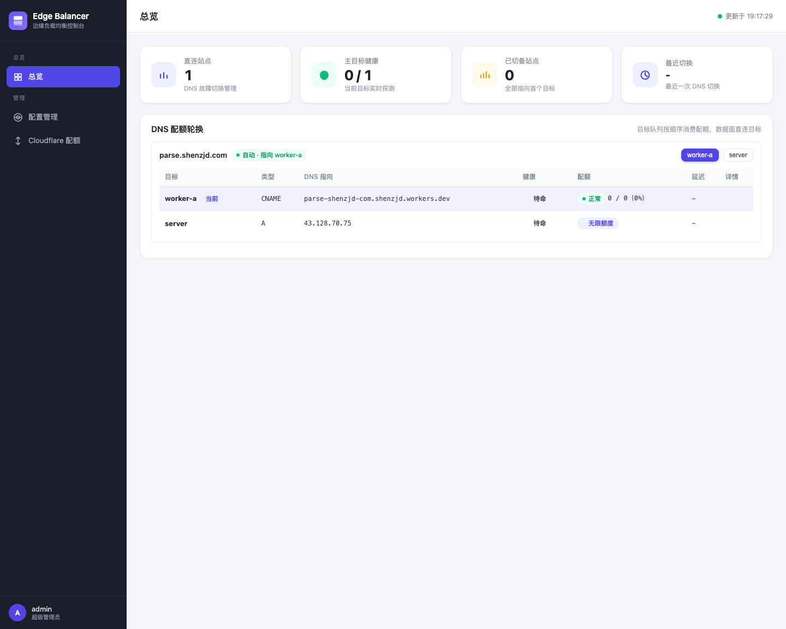
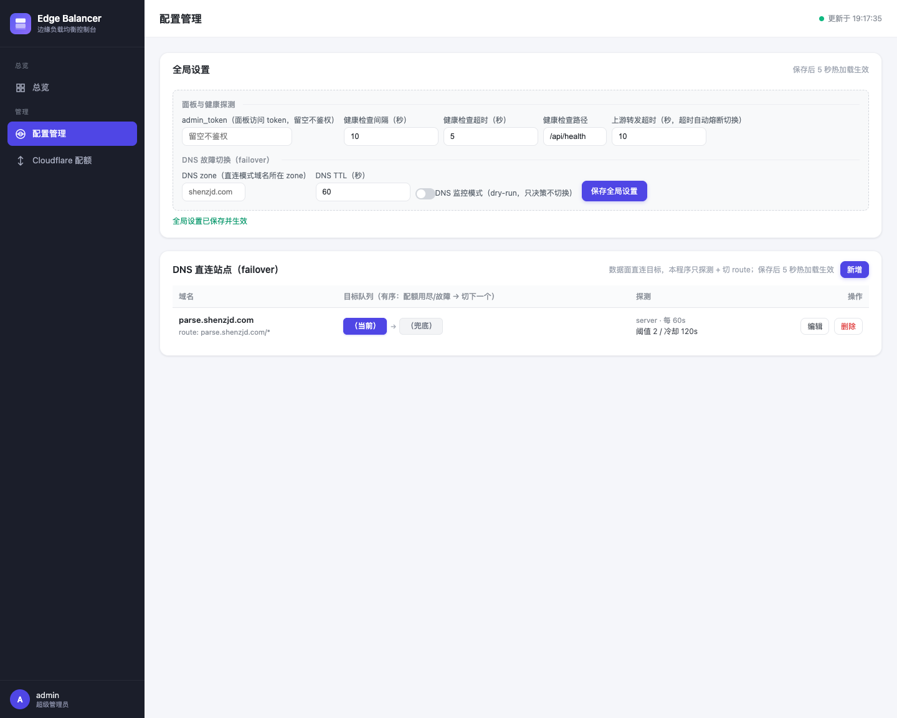
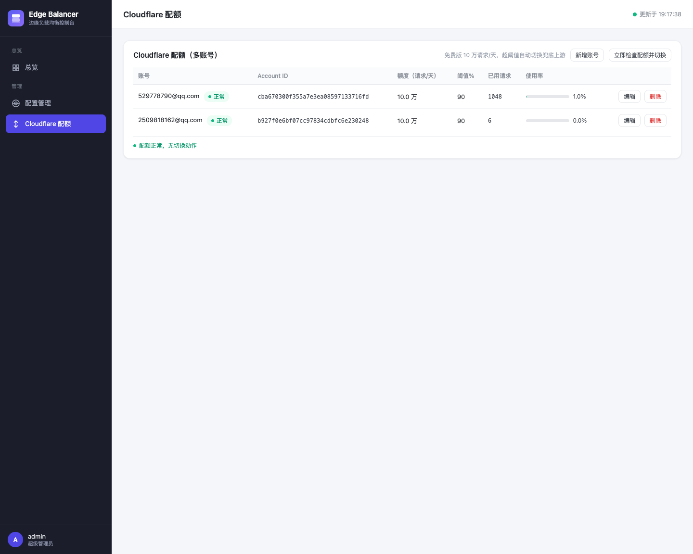

# edge-balancer

**Cloudflare Worker 配额轮换控制面** —— 自己的域名直连 CF Worker（不暴露 `*.workers.dev`），免费版配额（10 万请求/天/账号）用完自动切下一个目标；多 Worker / 服务器兜底按有序队列轮换，每日配额重置自动回切。Go 单二进制，Docker 一键部署。

免费替代「Cloudflare Load Balancer + 多账号 Worker 手动切流」。

## 解决的问题

- 不想暴露 `*.workers.dev` → 自己的域名直连 Worker，数据面不绕路
- CF Workers Free 配额是**账号级**（10 万请求/**天**）→ 配额用完**自动**切下一个账号 / 目标
- 不想盯着面板手动切 → 双信号自动决策（配额超限 / 健康失败），每日零点自动回切

## 特性

- **配额轮换队列**：N 个目标有序排列（worker-a → worker-b → server 兜底），配额用尽或故障 → 切下一个；每日配额重置自动切回最早可用目标
- **双信号决策**：配额（GraphQL 按账号查当天用量）为主，健康为辅（严格判定：连接拒绝 / 4xx / 5xx 连续 3 次才算挂，**超时不判挂**，防服务器侧线路误判）
- **数据面直连**：只切 DNS / Workers Route，不转发字节，用户直连目标（快、省、不绕路）
- **切换秒级生效**：增删 Workers Route / DNS 记录，proxied 下用户 DNS 缓存不影响
- **凭据零落盘**：所有 token 走环境变量（`token_env`），面板不回传明文
- **DB 模式 + 热加载**：Turso(libSQL) 存储，面板改配置 5 秒生效，无需重启
- **管理面板三页**：总览（KPI + 站点队列实时状态）/ 配置管理（全局设置 + 站点 CRUD）/ Cloudflare 配额（多账号水位监控）

## 架构

```
                ┌───────────────────────────────────────────┐
  用户 ── 自己域名 ──►  CF 边缘（proxied，用户只见自己域名）     │
                │    Route → worker-a（账号 A 配额）            │
                │    配额用尽 / 故障 → 切换（增删 Route）        │
                │    Route → worker-b（账号 B 配额）            │
                │    Route → server 兜底（A 记录回源服务器）     │
                └────────────────────▲──────────────────────┘
                                     │ 决策：配额查询 + 健康探测
                          edge-balancer（Docker 控制面，不转发流量）
```

## 快速开始

```bash
# 本地跑（DB 模式，配置全在面板编辑）
set -a; source .env; set +a   # EDGE_DB_URL / EDGE_DB_TOKEN / 各 CF token
go run ./cmd/edge-balancer

# 或 Docker（服务器部署）
docker build -t edge-balancer .
docker run --network host -e EDGE_DB_URL=... -e EDGE_DB_TOKEN=... edge-balancer
```

面板：`http://<host>/admin?token=<admin_token>`

## 配置

推荐 **DB 模式**（设 `EDGE_DB_URL` / `EDGE_DB_TOKEN`，站点 / 目标队列 / CF 账号 / 全局设置全在面板编辑，5s 热加载）；本地调试可用 `config.yaml` 文件模式。完整示例见 [`config.example.yaml`](config.example.yaml)。

```yaml
dns:
  zone: "shenzjd.com"            # 域名 zone（Cloudflare 托管）
  token_env: "CF_API_TOKEN"      # 切换 token（Zone.DNS:Edit + Workers Routes:Edit）
  dry_run: true                  # 监控模式：只决策不切换；验证后改 false

cf_accounts:
  - name: "shenzjd"              # 与 target.quota_account 对应
    account_id: "xxx"
    quota: 100000                # 免费版 10 万请求/天
    threshold: 90
    token_env: "CF_TOKEN_SHENZJD"

sites:
  - domain: "parse.shenzjd.com"
    targets:                     # 有序队列：配额用尽/故障 → 切下一个；末位为兜底
      - name: "worker-a"
        record_type: "CNAME"
        dns_content: "parse-shenzjd-com.shenzjd.workers.dev"
        quota_account: "shenzjd"      # 配额定标：有 quota_account 的都有额度上限
      - name: "server"
        record_type: "A"
        dns_content: "43.128.70.75"
        url: "http://127.0.0.1:5269"  # 无 quota_account = 无限额度兜底
    probe:
      interval: 10
      fail_threshold: 3          # 连续失败 3 次判挂
      cooldown: 120
```

## 管理面板







## 代码结构

```
cmd/edge-balancer/   # 入口
internal/config/     # 配置模型 + 校验
internal/store/      # Turso(libSQL) 存储与迁移
internal/cf/         # Cloudflare 用量查询（配额信号）
internal/dns/        # DNS / Workers Route 切换
internal/failover/   # 配额轮换状态机（队列指针 + 双信号 + 每日回切）
internal/dataplane/  # 数据平面（旧转发模式，兼容保留）
internal/admin/      # 管理面板（go:embed HTML + 配置 CRUD + 配额监控）
```

## License

[MIT](LICENSE)
